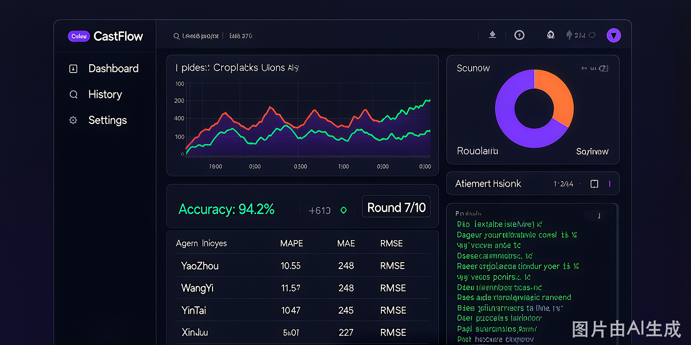

<p align="center">
  
</p>

<p align="center">
  
</p>

<h1 align="center">CastFlow</h1>

<p align="center">
  <strong>Self-Iterating Multi-Agent Forecasting System</strong>
</p>

<p align="center">
  <a href="https://github.com/XiaoNianGao564/CastFlow/stargazers"></a>
  
  
  
  
  
  
</p>

<p align="center">
  <a href="#-what-is-castflow">About</a> &middot;
  <a href="#-architecture">Architecture</a> &middot;
  <a href="#-core-innovation">Innovation</a> &middot;
  <a href="#-memory-system">Memory</a> &middot;
  <a href="#-quick-start">Quick Start</a> &middot;
  <a href="#api-endpoints">API</a>
</p>

---

## What is CastFlow?

CastFlow is a **multi-agent system** that autonomously writes, executes, evaluates, and iteratively patches its own Python forecasting code to improve prediction accuracy over time.

Unlike traditional ML pipelines where humans tune hyperparameters, CastFlow's agents generate **complete prediction scripts**, run them against real data, analyze errors with LLM reasoning, and apply **minimal code patches** — adjusting only what needs to change. This creates a self-improving loop that converges toward better accuracy without human intervention.

The system is production-deployed for **power load forecasting across 5 districts in Tongchuan, China**, but the architecture is model-agnostic and can be adapted to any time-series prediction task.

---

## Architecture

<p align="center">
  
</p>

<p align="center">
  <b>11 agents</b> &middot; <b>4 orchestration modes</b> &middot; <b>31 prediction models</b> &middot; <b>3-layer memory</b>
</p>

### Agent Roster

| Agent | Role | Temp |
|:------|:-----|:----:|
| **CoordinatorAgent** | Master orchestrator, manages all loop modes | — |
| **PlannerAgent** | Data diagnosis, model selection, initial code gen | 0.3 |
| **ReActPlanner** | Thought &rarr; Action &rarr; Observation dynamic dispatch | 0.4 |
| **ForecasterAgent** | Iterative optimization loop (execute &rarr; evaluate &rarr; patch) | 0.6 |
| **CriticAgent** | Final review, structured report generation | 0.2 |
| **DataAgent** | MySQL data loading, integrity checks, characteristics | — |
| **CodeGenAgent** | LLM-powered Python prediction code generation | 0.3 |
| **ExecutionAgent** | Sandboxed Python subprocess execution | — |
| **EvaluationAgent** | MAPE / MAE / RMSE / accuracy calculation | — |
| **AnalysisAgent** | LLM-powered error root-cause analysis | 0.3 |
| **PatchAgent** | Minimal code patch generation + rule-based fallback | 0.6 |
| **ModelSelector** | Data-characteristic-based model scoring (31 models) | — |

### Four Orchestration Modes

| Mode | Strategy |
|:-----|:---------|
| **Full Loop** | Classic sequential: data &rarr; code gen &rarr; execute &rarr; wait &rarr; evaluate &rarr; patch &rarr; iterate |
| **ReAct Loop** | LLM-driven dynamic tool dispatch with 11 tools (load_data, web_search, generate_code, patch_code, switch_model, ...) |
| **3-Agent Pipeline** | Planner (temp=0.3) &rarr; Forecaster (temp=0.6) &rarr; Critic (temp=0.2) with temperature-stratified personas |
| **Parallel Modes** | Multi-model parallel initial prediction + parallel iteration across models |

---

## Core Innovation

The key differentiator is how CastFlow improves itself — not by sweeping hyperparameters, but by **patching its own code**:

<p align="center">
  
</p>

| Mechanism | Description |
|:----------|:------------|
| **LLM patches, not rewrites** | Only parameters, preprocessing, or model logic are changed |
| **fallbackPatch** | Deterministic regex-based rules fire in **&lt;1ms** before any LLM call |
| **Always-rollback-to-best** | Non-improving iterations never become the new baseline |
| **Empty patch detection** | 3 consecutive empty patches &rarr; forced fallback |

---

## Memory System

CastFlow accumulates knowledge across sessions through three complementary stores:

| Layer | Store | What it remembers | Purpose |
|:-----:|:-----:|:------------------|:--------|
| 1 | **ExperienceStore** | Effective / ineffective strategies | Avoid repeating failures in future runs |
| 2 | **SkillStore** | Data profile &rarr; strategy fingerprints | Recommend proven strategies for similar tasks |
| 3 | **RAGStore** | Full analysis documents (TF-IDF indexed) | Semantic retrieval of relevant historical analyses |

---

## 31-Model Pool

CastFlow scores models against 6 data features (seasonality, trend, volatility, sample size, ...) with weighted scoring:

<details>
<summary><b>View all 31 models</b></summary>

**Statistical** — SARIMA, Holt-Winters (additive / multiplicative / damped), ETS, STL decomposition, Theta, SES, TBATS, GARCH, Croston, Dynamic Regression

**Machine Learning** — XGBoost, LightGBM, CatBoost, Random Forest, MLP, Linear Regression

**Ensemble / Hybrid** — Weighted ensemble (auto-tuned), ARIMA+XGBoost, ETS+XGBoost, 3-model voting, ARIMA+seasonal decomposition

</details>

---

## Tech Stack

```
Runtime          Bun 1.3+ / TypeScript 5.8 (strict)
Monorepo         Turborepo
Frontend         SolidJS + Tailwind CSS v4 + Vite
API              Hono + SSE (Server-Sent Events)
Core Logic       Hand-crafted TypeScript agents (no framework)
LLM              Qwen (qwen-plus) via DashScope / Vercel AI SDK
Python Backend   pandas, numpy, pymysql, statsmodels, scikit-learn
Database         MySQL (source data)
Storage          File-based JSON (iterations, experience, skills, RAG)
```

---

## Project Structure

```
CastFlow/
├── packages/
│   ├── core/                    # Agent system, types, stores
│   │   └── src/
│   │       ├── agents/          # 12 agent files
│   │       ├── llm/client.ts    # Unified LLM client
│   │       ├── db/mysql.ts      # MySQL reader via Python subprocess
│   │       ├── store/           # experience, iteration, rag, skills
│   │       └── types.ts         # Zod schemas
│   ├── api/                     # Hono HTTP server (REST + SSE)
│   └── app/                     # SolidJS frontend
├── python/                      # ML dependencies
├── docs/                        # Diagrams & assets
├── .github/                     # Issue & PR templates
├── start.bat                    # One-click launch
└── turbo.json
```

---

## Key Features

- **Data integrity checks** (Phase 0) — validates all districts, no zero values, minimum 12-month history
- **Smart model selection** — scores 31 models against data characteristics before first code gen
- **Two-tier syntax repair** — fast regex fallback (&lt;1ms), then LLM repair (up to 2 retries)
- **Code generation retry** — syntax errors / short code / API failures &rarr; up to 3 retries
- **Web research integration** — real-time Sogou search for domain knowledge injection
- **Human-in-the-loop** — auto-pauses after 5 rounds of no improvement or 3 empty patches
- **Auto-generated reports** — structured JSON with per-district performance & recommendations
- **Real-time dashboard** — SSE streaming + accuracy trend charts + per-district comparison

---

## Quick Start

### Prerequisites

- [Bun](https://bun.sh/) >= 1.3
- Python >= 3.8 with `pip install pandas numpy pymysql statsmodels scikit-learn`
- MySQL with target database
- LLM API key (Qwen/DashScope or any OpenAI-compatible endpoint)

### Setup

```bash
git clone https://github.com/XiaoNianGao564/CastFlow.git
cd CastFlow

# Install dependencies
bun install

# Configure LLM API key
echo "sk-your-api-key" > .api_key
# Or: export DASHSCOPE_API_KEY=sk-your-api-key
```

### Configure Database

```bash
export DB_HOST=127.0.0.1
export DB_PORT=3306
export DB_USER=root
export DB_PASSWORD=root
export DB_NAME=your_database
```

### Run

```bash
# Windows one-click (API :3003 + Web :3000)
start.bat

# Or manually
bun run dev:api    # API server
bun run dev:app    # Frontend dev server
```

Open **http://localhost:3000** in your browser.

---

## API Endpoints

| Method | Path | Description |
|:------:|:-----|:------------|
| POST | `/api/forecast/start` | Start full iteration loop |
| POST | `/api/forecast/parallel-start` | Multi-model parallel prediction |
| POST | `/api/forecast/react-start` | ReAct dynamic planning mode |
| POST | `/api/forecast/parallel-iterate` | Parallel iteration across models |
| GET | `/api/forecast/status` | Current iteration status |
| GET | `/api/forecast/report` | Final structured report |
| GET | `/api/events` | SSE stream for real-time updates |
| GET | `/api/models` | Available prediction models |
| GET | `/api/health` | System health check |

---

## Design Decisions

<details>
<summary><b>Why code patches instead of hyperparameter tuning?</b></summary>

Traditional AutoML adjusts numeric knobs. CastFlow's LLM can modify **data preprocessing**, **feature engineering**, **model structure**, and **post-processing** — changes that parameter sweeps cannot express. A patch might add a moving average filter to training data, switch from additive to multiplicative seasonality, or introduce a residual correction step.
</details>

<details>
<summary><b>Why fallbackPatch before LLM?</b></summary>

LLM calls take 5–60 seconds and cost money. Most syntax errors in generated code are caused by a handful of patterns (unclosed strings, mismatched brackets, maxiter too low). The deterministic `fallbackPatch` handles these in under 1ms. LLM repair is reserved for genuinely novel errors.
</details>

<details>
<summary><b>Why file-based storage instead of a database?</b></summary>

CastFlow's iteration data is inherently append-only and session-scoped. JSON files provide zero-config persistence, easy debugging (just open the file), and simple backup. For source data (MySQL), the system already uses a proper database. Agent state doesn't need ACID transactions — it needs readability.
</details>

---

## Inspired by CastClaw

CastFlow draws inspiration from [CastClaw](https://github.com/castclaw/castclaw) (USTC + Huawei joint project):

- Monorepo structure (Bun + Turborepo)
- Planner &rarr; Forecaster &rarr; Critic agent pipeline
- Skill-based knowledge precipitation
- Experiment reflection and budget controls

**Key differences**: CastFlow is purpose-built for power load forecasting with MySQL integration, uses a self-iterating code patching loop (vs. experiment enumeration), and implements a three-layer memory system with RAG retrieval.

---

<p align="center">
  Built with Bun, TypeScript, SolidJS, and Qwen
</p>

<p align="center">
  <sub>MIT License &middot; CastFlow &copy; 2025</sub>
</p>
