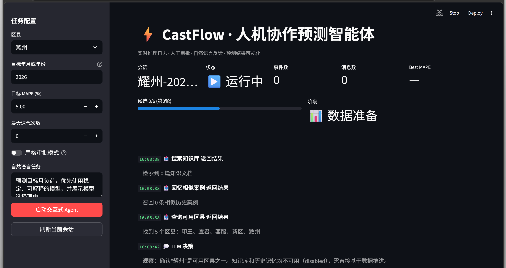
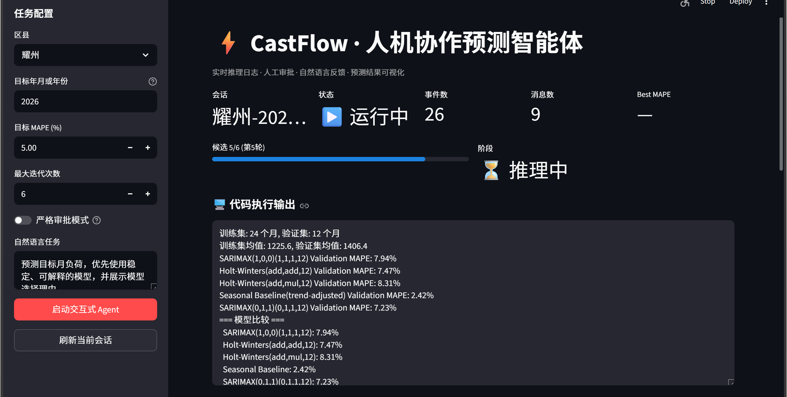
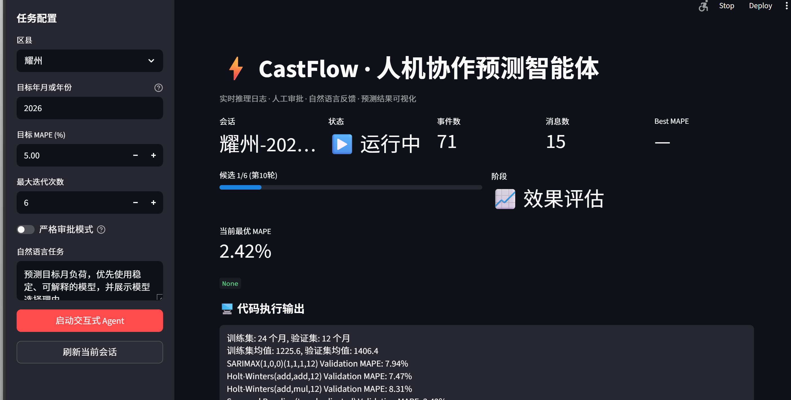
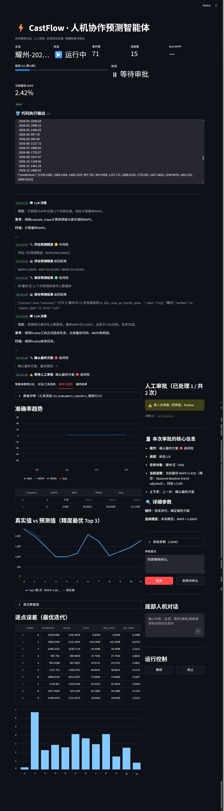

# CastFlow

**自迭代多 Agent 电力负荷预测系统** · 基于 LangGraph + 通义千问

[](https://www.python.org/)
[](https://langchain-ai.github.io/langgraph/)
[](https://dashscope.aliyun.com/)

---

## What is CastFlow

CastFlow 是一个**真正意义上的 Agent 系统**：LLM 通过原生 tool-calling 自主决策每一步，
替代传统硬编码的 ML 流水线。给定区县和目标月份，Agent 会自主完成：

```
取数据 → 选模型 → 写 Python → 跑代码 → 评估 MAPE → 反思 → 迭代 → 达标收尾
```

业务场景：铜川 5 区电力负荷预测，目标 MAPE ≤ 5%。

## Architecture (Stage A)

```
         ┌──────────────────────┐
         │   Orchestrator       │  qwen-max + tool-calling
         │   (LangGraph 节点)    │
         └──────────┬───────────┘
                    │
            ┌───────▼────────┐
            │   ToolNode     │
            └───────┬────────┘
                    │
   ┌────────┬───────┼───────┬──────────┬──────────┐
   ▼        ▼       ▼       ▼          ▼          ▼
load_   load_   run_    evaluate_  finalize   (Stage B:
history actual  python  mape                  memory/MCP)
```

## Quick Start

```bash
# 1. 装 uv（推荐）或用 pip
pip install uv

# 2. 创建虚拟环境并安装依赖
uv venv
uv pip install -e .

# 3. 配置（见下方 ⚙️ Configuration 章节）
cp .env.example .env
# 编辑 .env 填入 DASHSCOPE_API_KEY（必填）和数据库信息（按需）

# 4.（推荐）启动 Chroma HTTP server（解决嵌入式模式在多线程下的兼容问题）
docker compose up -d chromadb

# 5. 运行
python run.py              # 默认 耀州 / 2026-12
python run.py 印王 2026-12 # 指定区县/月份
```

> 不想用 Docker 也可以：保持 `.env` 里 `CHROMA_HTTP_HOST` 留空，会自动 fallback
> 到本地 PersistentClient（在主 Agent 单线程场景下工作正常；多线程 eval 场景
> 推荐 HTTP 模式，详见下面「Memory: Chroma HTTP server」一节）。

---

## ⚙️ Configuration — 在哪里填写 Key 和数据库配置

CastFlow 所有配置通过 `.env` 文件管理。配置模板见项目根目录的 `.env.example`。

### 必填配置

| 变量 | 说明 | 在哪里获取/填写 |
|------|------|----------------|
| `DASHSCOPE_API_KEY` | 🔴 **必填** — 通义千问 API Key | [DashScope 控制台](https://dashscope.console.aliyun.com/apiKey) → 创建 API Key → 复制 `sk-` 开头的值填入 |
| `LLM_MODEL` | 主 Agent 模型 | 推荐保持 `qwen3.6-flash`，也可改为 `qwen-max` / `qwen-plus` |
| `LLM_MODEL_SUBAGENT` | 子 Agent 模型 | 同上 |

### 数据库配置（按需）

| 变量 | 说明 | 何时需要修改 |
|------|------|------------|
| `MYSQL_HOST` | MySQL 主机地址 | 本地开发：`127.0.0.1`；Docker 部署：`mysql`（服务名） |
| `MYSQL_PORT` | MySQL 端口 | 本地开发：`3306`；Docker 部署：`3306`（容器内端口） |
| `MYSQL_USER` / `MYSQL_PASSWORD` | 数据库账号密码 | 替换为你的数据库凭据 |
| `MYSQL_DB` | 数据库名 | 替换为你的实际库名 |
| `USE_REAL_DB` | 是否连接真实数据库 | `false` = 使用内置模拟数据；`true` = 连接真实 MySQL |

### Docker 部署特别注意

`docker-compose.yml` 中的 `castflow` 服务会从宿主机 `.env` 读取 `DASHSCOPE_API_KEY`。
容器内 MySQL/Chroma 的服务地址已预设为容器服务名，通常无需修改。
详见 [`DOCKER_DEPLOY.md`](./DOCKER_DEPLOY.md)。

### 可选配置

| 变量 | 说明 |
|------|------|
| `CHROMA_HTTP_HOST` | Chroma 向量库地址（Docker 部署填 `chromadb`） |
| `LANGFUSE_*` | 全链路 trace（可选，留空关闭） |
| `MCP_ENABLED` | 启用 MCP 工具加载 |
| `SCHEDULER_*` | 轮询调度器（真实值到达自动触发预测） |

> ⚠️ **不要将你的 `.env` 文件提交到 Git！** `.env` 已在 `.gitignore` 中，只需复制 `.env.example` 并填入你的值即可。

---

## 🖼️ 运行效果

以下截图来自 CastFlow 在铜川市电力负荷预测任务中的真实运行记录。

### 1. 数据准备 — Agent 自动加载历史、搜索知识库


### 2. 模型评估 — Coder/Verifier/Refiner 多智能体协同


### 3. 最佳结果 — MAPE 2.42% 达标，自动保存


### 4. 完整仪表盘 — 审批门控、趋势图、预测 vs 真实对比


---

## Memory: Chroma HTTP server

CastFlow 的三层记忆（episodic / semantic）默认连 Docker 部署的 chromadb HTTP server，
原因和真实踩过的坑：

- chromadb 1.5.x 嵌入式模式在 LangGraph ToolNode 多线程 + 重复 `PersistentClient(path=...)`
  场景下不稳，会抛 `AttributeError: 'RustBindingsAPI' object has no attribute 'bindings'`
  或 `Could not connect to tenant default_tenant`，导致 eval 跑批时 memory 失败
- chromadb 0.5.x 依赖 `chroma-hnswlib`，在 Windows 需要 MSVC 编译，开箱即用麻烦
- HTTP 模式下 client 是纯 REST 封装，没有 Rust bindings 也没有 tenant bootstrap，
  所有兼容 bug 直接绕过

启动 / 关闭：

```bash
# 启动（首次会拉 chromadb/chroma:1.0.5 镜像，约 200MB）
docker compose up -d chromadb

# 状态 / 心跳
docker compose ps
curl http://127.0.0.1:8001/api/v2/heartbeat

# 关闭（数据保留在 ./data/chroma_server/，下次启动自动恢复）
docker compose down
```

`castflow/memory/chroma_compat.py` 同时保留了对嵌入式模式的兼容性 patch
（`safe_persistent_client` 自动 ensure tenant + retry + clear cache），
所以 `CHROMA_HTTP_HOST` 留空时仍可工作。

## Document RAG: Knowledge Base

CastFlow 现在除了 Agent 记忆，还补了一层**文档知识库 RAG**：

- `docs/knowledge/` 放稳定业务文档
- `ingest_knowledge_docs()` 把文档导入 Chroma `knowledge_docs` collection
- `search_knowledge_docs()` 在选模型前检索数据口径、建模规则、评估规范
- 该层和 episodic / semantic memory 分开，避免把“业务文档”与“历史经验”混在一起

建议放入的文档类型：

- 数据口径说明
- 指标定义和评估规则
- 建模策略约束
- 常见失败模式和处理原则

## Project Layout

```
castflow/
├── config.py            集中配置
├── state.py             ForecastState (TypedDict + reducer)
├── prompts.py           Orchestrator system prompt
├── graph/
│   ├── orchestrator.py  build_graph() 主图
│   ├── nodes.py         orchestrator_node + force_finalize_node
│   └── edges.py         路由：should_continue / after_tools
├── tools/
│   ├── data.py          list_orgs / load_history / load_actual
│   ├── python_exec.py   run_python (subprocess + timeout)
│   ├── eval.py          evaluate_mape
│   ├── memory.py        recall_similar_runs / recall_lessons / save_lesson
│   ├── knowledge.py     ingest_knowledge_docs / search_knowledge_docs
│   ├── mcp_loader.py    通过 langchain-mcp-adapters 加载 MCP 工具
│   └── finalize.py      finalize
├── memory/
│   ├── episodic.py      历次 run 向量库（Chroma）
│   ├── semantic.py      lesson 向量库（Chroma）
│   ├── knowledge.py     文档知识库（Chroma）
│   └── embedding.py     DashScope text-embedding-v2
├── subagents/
│   └── reflector.py     Reflexion 反思子 Agent
├── llm/client.py        ChatOpenAI 走 Qwen 兼容协议
└── db/
    ├── mock.py          MockDB（默认）
    └── mysql.py         真 MySQL（USE_REAL_DB=true 启用）

mcp_servers/
└── castflow_data.py     MCP Server (FastMCP, stdio)
```

## MCP Server (Stage B7)

CastFlow 把电力数据查询能力包装成符合 **Anthropic Model Context Protocol** 的
独立服务，任何 MCP 客户端（Claude Desktop / Cursor / Continue / 自建 Agent）
都能复用同一套工具。

### 暴露的能力

| 类型 | 名称 | 作用 |
|---|---|---|
| Tool | `list_orgs` | 列出所有可用区县 |
| Tool | `load_history(org, months, before_month)` | 取月度历史，支持 before_month 防数据泄漏 |
| Tool | `load_actual(org, month)` | 取真实值用于评估 |
| Resource | `castflow://orgs` | 区县名 JSON 数组 |
| Resource | `castflow://org/{org}/profile` | 单个区县完整画像 |
| Prompt | `forecast_task(org, target_month)` | 复用的预测任务 prompt 模板 |

### 独立运行（stdio 传输）

```bash
.venv\Scripts\activate
python -m mcp_servers.castflow_data
```

### 端到端 smoke test

```bash
python -m scripts.test_mcp
# 期望输出:
#   ===> 加载到 3 个 MCP 工具
#   ===> 远程调用 list_orgs() 返回 5 个区县
#   ===> MCP 端到端 smoke test 通过
```

### 接入 Claude Desktop

把以下内容加入 `%APPDATA%\Claude\claude_desktop_config.json`：

```json
{
  "mcpServers": {
    "castflow-data": {
      "command": "/path/to/CastFlow/.venv/Scripts/python.exe",
      "args": ["-m", "mcp_servers.castflow_data"],
      "cwd": "/path/to/CastFlow",
      "env": {
        "DASHSCOPE_API_KEY": "sk-...",
        "USE_REAL_DB": "true",
        "MYSQL_HOST": "127.0.0.1",
        "MYSQL_USER": "root",
        "MYSQL_PASSWORD": "root",
        "MYSQL_DB": "castflow_db"
      }
    }
  }
}
```

重启 Claude Desktop 即可在对话框右下角看到 castflow-data 工具，
可以直接说「用 castflow-data 查耀州 2026-12 的负荷」。

## Roadmap

- [x] **Stage A · MVP** — LangGraph 主图 + 5 个工具 + MemorySaver + CLI
- [x] **Stage B1** — 接真 MySQL，修复数据泄漏
- [x] **Stage B2** — Chroma 三层记忆 (working/episodic/semantic) + force_finalize
- [x] **Stage B3** — Reflexion 反思子 Agent (subagent-as-tool)
- [x] **Stage B4** — Coder 子 Agent（subagent-as-tool）
- [x] **Stage B5** — Langfuse 全链路 trace（graceful 降级）
- [x] **Stage B6** — DeepEval eval 框架 + Memory graceful 降级
- [x] **Stage B7** — MCP Server (Anthropic Model Context Protocol)
- [x] **Stage B8** — FastAPI SSE 流式 API
- [x] **Stage B9** — Streamlit 演示 UI

## Run the demo (B8 + B9)

两个终端：

```bash
# Terminal 1：起 FastAPI 后端
.venv\Scripts\activate
uvicorn api.server:app --host 0.0.0.0 --port 8000

# Terminal 2：起 Streamlit UI
.venv\Scripts\activate
streamlit run streamlit_app.py
```

浏览器打开 http://localhost:8501，左侧配置区县、目标月和自然语言任务，点「启动交互式 Agent」。
页面会展示：

- 智能体推理日志：任务理解、工具调度、模型选择、Verifier/Reflector 摘要
- 人工审批区：对高风险动作如 `run_python` / `finalize` 做批准或拒绝
- 底部人机对话区：运行中输入自然语言反馈、暂停、继续、重新规划、终止
- 可视化结果区：候选模型对比、MAPE/MAE/RMSE/bias 趋势、最终代码

API 文档（Swagger UI）：http://localhost:8000/docs

主要端点：

| 端点 | 方法 | 用途 |
|---|---|---|
| `/health` | GET | 健康检查 |
| `/runs` | POST | 创建并启动交互式运行 |
| `/runs/{thread_id}` | GET | 获取当前会话快照 |
| `/runs/{thread_id}/events` | GET | SSE 订阅结构化事件流 |
| `/runs/{thread_id}/approve` | POST | 提交人工审批 |
| `/runs/{thread_id}/feedback` | POST | 提交自然语言反馈/暂停/继续/重规划指令 |
| `/runs/{thread_id}/resume` | POST | 恢复等待中的运行 |
| `/runs/{thread_id}/cancel` | POST | 终止运行 |
| `/forecast/run` | POST | 兼容旧版：阻塞式跑完返回摘要 |
| `/forecast/stream` | POST | 兼容旧版：旧 SSE 消息流 |

## License

MIT
