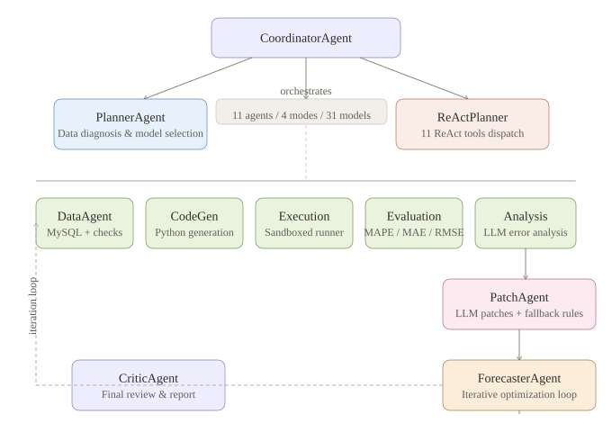
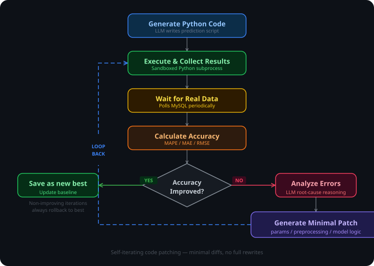

<p align="center">
  <strong>CastFlow</strong>
</p>

<p align="center">
  Self-Iterating Multi-Agent Forecasting System
</p>

<p align="center">
  
  
  
  
  
  
</p>

---

## What is CastFlow?

CastFlow is a **multi-agent system** that autonomously writes, executes, evaluates, and iteratively patches its own Python forecasting code to improve prediction accuracy over time.

Unlike traditional ML pipelines where humans tune hyperparameters, CastFlow's agents generate **complete prediction scripts**, run them against real data, analyze errors with LLM reasoning, and apply **minimal code patches** — adjusting only what needs to change. This creates a self-improving loop that converges toward better accuracy without human intervention.

The system is production-deployed for **power load forecasting across 5 districts in Tongchuan, China**, but the architecture is model-agnostic and can be adapted to any time-series prediction task.

## Architecture Overview

<p align="center">
  
</p>

**11 agents**, 4 orchestration modes, 31 prediction models, 3-layer memory system.

## Core Innovation: Self-Iterating Code Patching

The key differentiator is how CastFlow improves itself:

<p align="center">
  
</p>

- **LLM generates patches**, not full rewrites — only parameters, preprocessing, or model logic are changed
- **fallbackPatch**: deterministic local rules (regex-based parameter swaps) run first in **milliseconds** before any LLM call
- **Always-rollback-to-best**: non-improving iterations never become the new baseline — no cascading degradation
- **Empty patch detection**: 3 consecutive empty patches triggers forced fallback, preventing wasted API calls

## Three-Layer Memory System

CastFlow accumulates knowledge across sessions through three complementary stores:

| Layer | Store | What it remembers | Purpose |
|-------|-------|-------------------|---------|
| 1 | **ExperienceStore** | Effective/ineffective strategies | Inject into AnalysisAgent prompt to avoid repeating failures |
| 2 | **SkillStore** | Data profile → strategy fingerprints | Match similar future tasks and recommend proven strategies |
| 3 | **RAGStore** | Full analysis documents (TF-IDF indexed) | Semantic retrieval of relevant historical analyses during iteration |

## Agent Details

| Agent | Role | Temperature |
|-------|------|-------------|
| **CoordinatorAgent** | Master orchestrator, manages all loop modes | — |
| **PlannerAgent** | Data diagnosis, model selection, initial code gen | 0.3 |
| **ReActPlanner** | Thought→Action→Observation dynamic tool dispatch | 0.4 |
| **ForecasterAgent** | Iterative optimization loop (execute→evaluate→patch) | 0.6 |
| **CriticAgent** | Final review, structured report generation | 0.2 |
| **DataAgent** | MySQL data loading, integrity checks, characteristics | — |
| **CodeGenAgent** | LLM-powered Python prediction code generation | 0.3 |
| **ExecutionAgent** | Sandboxed Python subprocess execution | — |
| **EvaluationAgent** | MAPE/MAE/RMSE/accuracy calculation | — |
| **AnalysisAgent** | LLM-powered error root-cause analysis | 0.3 |
| **PatchAgent** | Minimal code patch generation + rule-based fallback | 0.6 |
| **ModelSelector** | Data-characteristic-based model scoring (31 models) | — |

## 31-Model Pool with Smart Selection

CastFlow scores models against 6 data features (seasonality strength, trend direction, volatility, sample size, etc.) with weighted scoring and bonus rules:

**Statistical**: SARIMA, Holt-Winters (additive/multiplicative/damped), ETS, STL decomposition, Theta, SES, TBATS, GARCH, Croston, Dynamic Regression

**Machine Learning**: XGBoost, LightGBM, CatBoost, Random Forest, MLP neural network, Linear Regression

**Ensemble/Hybrid**: Weighted ensemble (auto-tuned weights), ARIMA+XGBoost hybrid, ETS+XGBoost hybrid, 3-model voting ensemble, ARIMA+seasonal decomposition

## Tech Stack

```
Runtime          Bun 1.3+ / TypeScript 5.8 (strict)
Monorepo         Turborepo
Frontend         SolidJS + Tailwind CSS v4 + Vite
API              Hono + SSE (Server-Sent Events)
Core Logic       Hand-crafted TypeScript agents (no framework)
LLM              Qwen (qwen-plus) via DashScope / Vercel AI SDK
Python Backend   pandas, numpy, pymysql, statsmodels, scikit-learn
Database         MySQL (source data)
Storage          File-based JSON (iterations, experience, skills, RAG)
```

## Project Structure

```
CastFlow/
├── packages/
│   ├── core/                    # Agent system, types, stores
│   │   └── src/
│   │       ├── agents/          # 12 agent files
│   │       ├── llm/client.ts    # Unified LLM client (Vercel AI SDK + fetch)
│   │       ├── db/mysql.ts      # MySQL reader via Python subprocess
│   │       ├── store/           # experience, iteration, ragStore, skillStore, webSearch
│   │       └── types.ts         # Zod schemas for all data structures
│   ├── api/                     # Hono HTTP server (REST + SSE)
│   │   └── src/index.ts         # All endpoints
│   └── app/                     # SolidJS frontend
│       └── src/
│           ├── routes/          # Dashboard, History, Settings
│           └── App.tsx          # SSE + HTTP polling integration
├── python/                      # ML dependencies
│   └── requirements.txt
├── start.bat                    # One-click launch (API + Web)
└── turbo.json                   # Build pipeline
```

## Four Orchestration Modes

1. **Full Loop** — Classic sequential pipeline: data → code gen → execute → wait → evaluate → patch → iterate
2. **ReAct Loop** — LLM-driven dynamic tool dispatch with 11 available tools (load_data, web_search, generate_code, execute_code, evaluate, analyze_errors, patch_code, switch_model, etc.)
3. **3-Agent Pipeline** — Planner (temp=0.3) → Forecaster (temp=0.6) → Critic (temp=0.2) with temperature-stratified personas
4. **Parallel Modes** — Multi-model parallel initial prediction + parallel iteration across models

## Key Features

- **Data integrity checks** (Phase 0): validates all districts present, no zero values, minimum 12-month history
- **Smart model selection**: scores 31 models against data characteristics before first code generation
- **Two-tier syntax repair**: fast regex-based fallback (ms) tried first, then LLM repair (up to 2 retries)
- **Code generation retry**: syntax errors / short code / API failures → up to 3 retries with error feedback
- **Web research integration**: real-time Sogou search for domain knowledge injection
- **Human-in-the-loop**: auto-pauses after 5 rounds of no improvement or 3 consecutive empty patches
- **Auto-generated reports**: structured JSON with per-district performance, data characteristics, and recommendations
- **Real-time dashboard**: SSE streaming + accuracy trend charts + per-district comparison

## Quick Start

### Prerequisites

- [Bun](https://bun.sh/) >= 1.3
- Python >= 3.8 with `pip install pandas numpy pymysql statsmodels scikit-learn`
- MySQL with target database
- LLM API key (Qwen/DashScope or any OpenAI-compatible endpoint)

### Setup

```bash
# Clone the repository
git clone https://github.com/your-username/CastFlow.git
cd CastFlow

# Install dependencies
bun install

# Configure LLM API key (create .api_key file or set env var)
echo "sk-your-api-key" > .api_key
# Or: export DASHSCOPE_API_KEY=sk-your-api-key
```

### Configure Database

Edit `packages/core/src/types.ts` or set environment variables:

```bash
export DB_HOST=127.0.0.1
export DB_PORT=3306
export DB_USER=root
export DB_PASSWORD=root
export DB_NAME=your_database
```

### Run

```bash
# Windows (starts API on :3003 + Web on :3000)
start.bat

# Or manually:
bun run dev:api    # API server
bun run dev:app    # Frontend dev server
```

Open `http://localhost:3000` in your browser.

## API Endpoints

| Method | Path | Description |
|--------|------|-------------|
| POST | `/api/forecast/start` | Start full iteration loop |
| POST | `/api/forecast/parallel-start` | Multi-model parallel prediction |
| POST | `/api/forecast/react-start` | ReAct dynamic planning mode |
| POST | `/api/forecast/parallel-iterate` | Parallel iteration across models |
| GET | `/api/forecast/status` | Current iteration status |
| GET | `/api/forecast/report` | Final structured report |
| GET | `/api/events` | SSE stream for real-time updates |
| GET | `/api/models` | Available prediction models |
| GET | `/api/health` | System health check |

## Design Decisions

### Why code patches instead of hyperparameter tuning?

Traditional AutoML adjusts numeric knobs. CastFlow's LLM can modify **data preprocessing**, **feature engineering**, **model structure**, and **post-processing** — changes that parameter sweeps cannot express. A patch might add a moving average filter to training data, switch from additive to multiplicative seasonality, or introduce a residual correction step.

### Why fallbackPatch before LLM?

LLM calls take 5-60 seconds and cost money. Most syntax errors in generated code are caused by a handful of patterns (unclosed strings, mismatched brackets, maxiter too low). The deterministic `fallbackPatch` handles these in under 1ms with near-100% success for common cases. LLM repair is reserved for genuinely novel errors.

### Why file-based storage instead of a database?

CastFlow's iteration data is inherently append-only and session-scoped. JSON files provide zero-config persistence, easy debugging (just open the file), and simple backup. For the source data (MySQL), the system already uses a proper database. The agent state doesn't need ACID transactions — it needs readability.

## Inspired by CastClaw

CastFlow's architecture draws inspiration from [CastClaw](https://github.com/castclaw/castclaw) (USTC + Huawei joint project), specifically:

- Monorepo structure (Bun + Turborepo)
- Planner → Forecaster → Critic agent pipeline
- Skill-based knowledge precipitation
- Experiment reflection and budget controls

Key differences: CastFlow is purpose-built for power load forecasting with MySQL integration, uses a self-iterating code patching loop (vs. experiment enumeration), and implements a three-layer memory system with RAG retrieval.

## License

MIT
